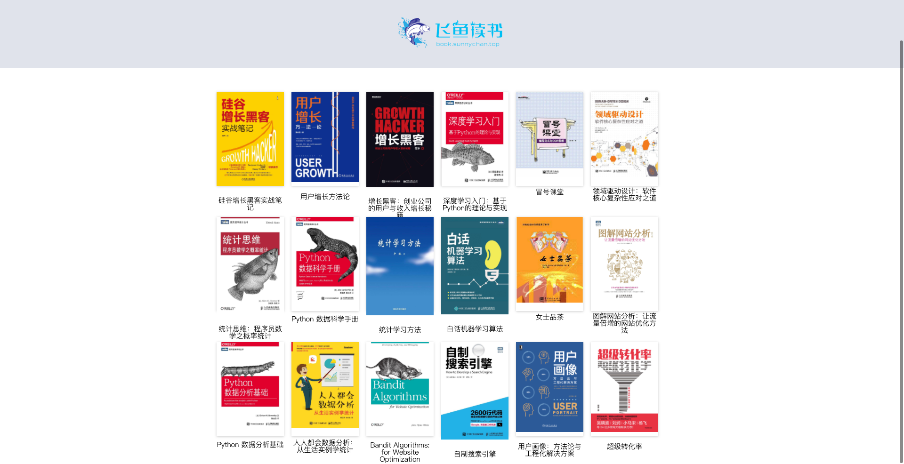
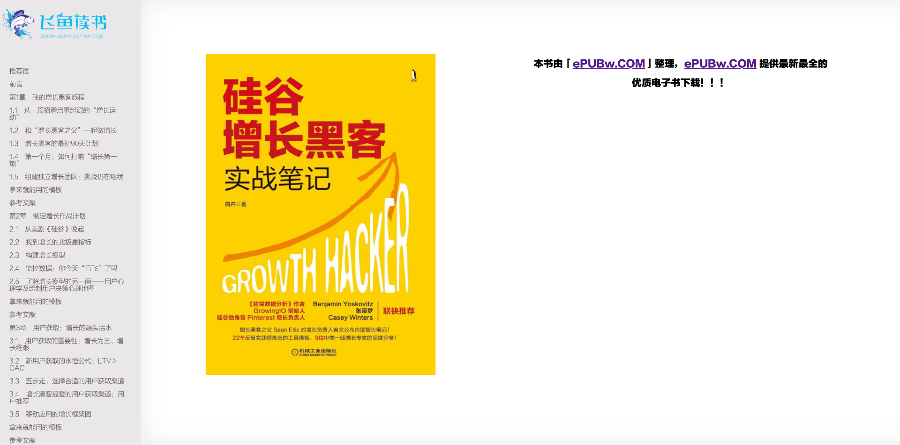

飞鱼读书 (Flish Reader)
=================


一个基于 Vue 的 Web 读书平台，我主要它来学习下前端技术，顺便解决下自己方便阅读电子书的需求。  





## 使用  

目前项目已经可用，本地或者部署至服务器都可以。 

在data目录存放电子书（只支持epub）相关信息，把书籍拷贝到 data/files 目录，  
然后在 data/books.json 文件增加一条相应的记录即可。  

启动项目，参考下面。  

## Project setup
```
yarn install
```

### Compiles and hot-reloads for development
```
yarn serve
```

### Compiles and minifies for production
```
yarn build
```

### Lints and fixes files
```
yarn lint
```

### Customize configuration  

See [Configuration Reference](https://cli.vuejs.org/config/).
